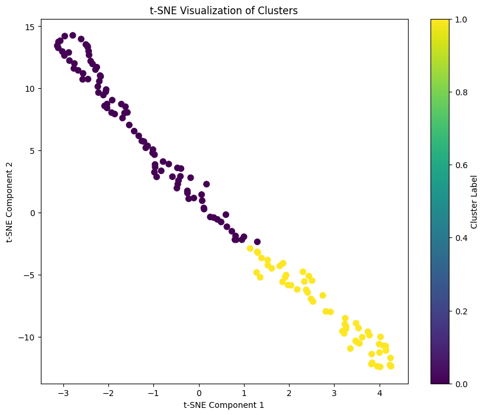
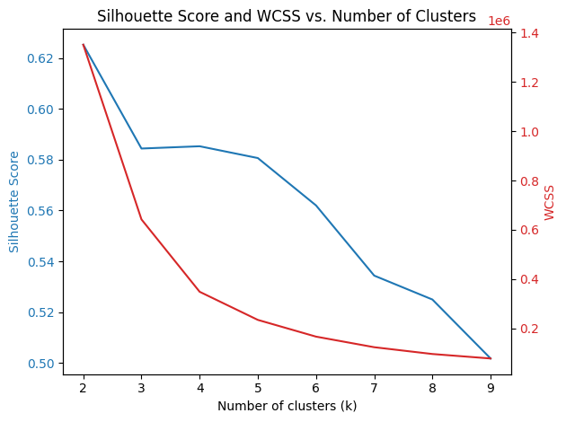

# General Test: ALMA Synthetic Continuum Observations Clustering Pipeline

Data Augmented to apply random rotations (0°, 90°, 180°, or 270°) during training to improve the model's robustness.

Built and trained an autoencoder to learn a compact latent representation of the images.

Used these latent representations to perform clustering with KMeans. Evaluates clusters using silhouette scores and WCSS (Within-Cluster Sum of Squares) to determine the optimal number of clusters.

## Results
Optimal number of clusters based on silhouette score: 2  
At k = 2, Silhouette Score = 0.6253

| k | Silhouette Score
|---|:--------------:|
| 2 |     0.6253     |
| 3 |     0.5844     |
| 4 |     0.5853     |
| 5 |     0.5807     |
| 6 |     0.5620     |
| 7 |     0.5344     |
| 8 |     0.5250     |
| 9 |     0.5017     |

## Physical Properties via Visual Inspection

| Property | Cluster 0 | Cluster 1 | Physical Significance |
|----------|-----------|-----------|------------------------|
| Ring Structure | Multiple rings/gaps | Predominantly single rings | Indicates different stages of planet formation or multiple forming planets |
| Disk Geometry | More elliptical appearance | More circular appearance | Suggests different viewing angles (inclination) or intrinsic structural differences |
| Brightness Distribution | More varied, often asymmetric | More uniform and symmetric | May indicate dust distribution patterns and gravitational perturbations |
| Gap Definition | Sharper transitions between rings | Smoother transitions | Related to planet mass, disk viscosity, and dust migration mechanisms |
| Central Cavity | Variable size and definition | More consistent size | Possibly correlated with stellar wind strength or inner planet clearing |

## Detailed Analysis of Properties and Their Astrophysical Implications

### 1. Ring and Gap Structures

Protoplanetary disks develop rings and gaps primarily through interactions with forming planets. The observed differences between clusters have significant implications:

- **Multiple Ring Systems (Cluster 0)**: 
  - Suggests the presence of multiple planets at different orbital radii
  - Each planet creates a distinct gap by clearing material along its orbit
  - The width and depth of gaps correlate with planet mass
  - More complex systems may indicate a more advanced evolutionary stage or a more massive initial disk

- **Single Ring Systems (Cluster 1)**:
  - May represent earlier stages of planet formation
  - Could indicate the presence of a single dominant forming planet
  - Alternatively, might represent systems where conditions support fewer planet formation sites
  - The smoother transitions suggest less massive planets or different disk viscosity

### 2. Disk Geometry and Inclination

The apparent shape of protoplanetary disks provides information about both viewing geometry and physical properties:

- **Elliptical Appearance (Cluster 0)**:
  - Primary cause is likely viewing angle (inclination relative to line of sight)
  - Higher inclination makes circular disks appear elliptical
  - Can complicate interpretation of gap width and brightness patterns
  - May indicate selection bias in the clustering algorithm

- **Circular Appearance (Cluster 1)**:
  - Suggests more face-on viewing angles
  - Provides clearer view of radial structures
  - Enables more accurate measurements of gap positions and widths
  - Facilitates better estimation of planet orbital distances

### 3. Brightness Distribution and Asymmetry

Brightness variations across the disk reflect the distribution of dust that scatters or emits radiation:

- **Asymmetric Brightness (Cluster 0)**:
  - May indicate the presence of dust traps or vortices
  - Could be caused by gravitational perturbations from companions or nearby stars
  - Associated with local pressure maxima where dust accumulates
  - Often sites of accelerated planet formation

- **Uniform Brightness (Cluster 1)**:
  - Suggests more quiescent disks with less perturbation
  - More axisymmetric gas and dust distribution
  - May indicate different dust grain properties or size distributions
  - Could represent younger, less evolved systems

### 4. Gap Definition and Transition Sharpness

The sharpness of transitions between bright rings and dark gaps provides insights into disk physics:

- **Sharp Transitions (Cluster 0)**:
  - Indicates more massive planets creating well-defined pressure gradients
  - Associated with lower disk viscosity that maintains sharper features
  - May signify more efficient dust filtration mechanisms at gap edges
  - Could indicate stronger gas-dust coupling

- **Smooth Transitions (Cluster 1)**:
  - Suggests lower-mass planets or proto-planets
  - May indicate higher disk viscosity that diffuses sharp features
  - Could represent earlier stages of gap opening
  - Possibly associated with different grain size distributions

### 5. Central Cavity Characteristics

The central region of protoplanetary disks can reveal processes close to the star:

- **Variable Central Features (Cluster 0)**:
  - Differences in inner disk clearing mechanisms
  - May indicate varying strengths of stellar winds or magnetic fields
  - Could suggest the presence of close-in massive planets
  - Diversity might reflect different stellar masses or ages

- **Consistent Central Cavities (Cluster 1)**:
  - More uniform inner disk evolution
  - Possibly similar stellar properties across the sample
  - More consistent inner rim physics
  - May represent a more homogeneous population of young stellar objects

## Implications for Planet Formation

The distinction between these clusters has important implications for understanding planet formation processes:

1. **Formation Pathways**: The two clusters may represent different evolutionary pathways or timescales for planet formation.

2. **Planetary System Architecture**: Cluster 0 disks may be more likely to form systems with multiple planets at various distances, while Cluster 1 might favor simpler planetary configurations.

3. **Disk Environment**: The differences could reflect variations in the initial conditions of the protoplanetary disks, such as mass, composition, or the properties of the host star.

4. **Age Sequence**: The clusters might represent different temporal stages in disk evolution, with one cluster potentially being systematically older than the other.

5. **Planet-Disk Interaction**: The variations in gap structure provide evidence for how forming planets interact with their natal disks, potentially revealing information about planet mass and migration mechanisms.

The clean separation in the t-SNE visualization suggests that despite these potential observational factors, the clustering has identified physically meaningful distinctions between different populations of protoplanetary disks.

## Link to trained model:
https://drive.google.com/drive/folders/173sl6xVV7W9PaMn8oIXRTBtDU2JVsC3O?usp=sharing
