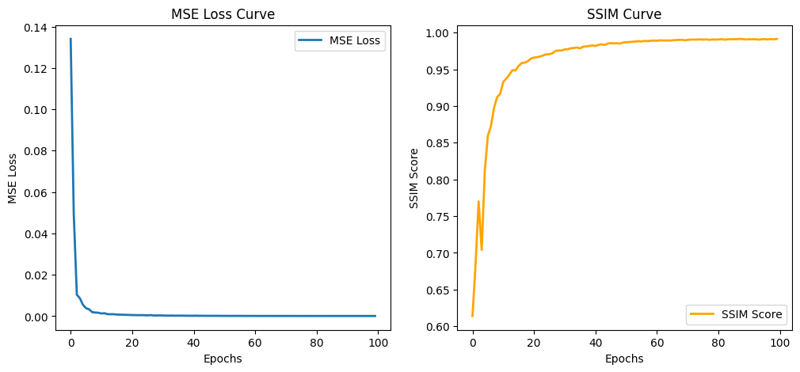

# Image-Based Test: ALMA Autoencoder for 1250μm Continuum Observations

This project focuses on reconstructing astronomical images from .fits files using a convolutional autoencoder. The model compresses input images into a 256-dimensional latent space and reconstructs them while preserving essential features. Training is performed using a combination of Mean Squared Error (MSE) and Structural Similarity Index (SSIM) loss, ensuring both pixel-wise accuracy and perceptual similarity. The autoencoder is trained using an Adam optimizer with cosine annealing scheduling, leveraging GPU acceleration and mixed-precision computation for efficiency.

## Results

| Metric | Value    |
|--------|---------|
| **MSE (Mean Squared Error)** | 0.000077  |
| **SSIM (Structural Similarity Index)** | 0.991275  |

## Link to trained model:
https://drive.google.com/drive/folders/1IbIml7enPwxCMhQFm2hLLSX8pAnKvmHc?usp=sharing