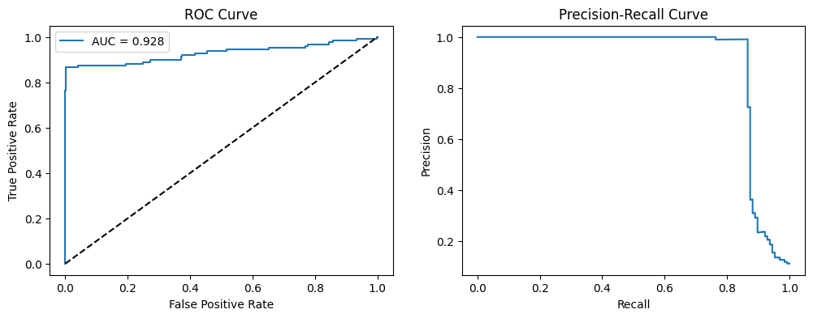
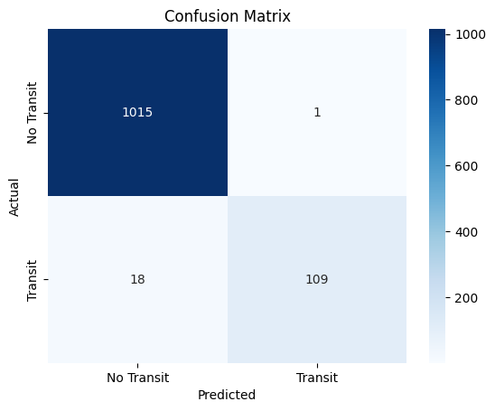

# Sequential Task: Transit Classifier

This project implements a deep learning pipeline for detecting transit events in astronomical light curve data. The pipeline includes:

- Synthetic and Observational Data: Synthetic data generation for transits, plus observational data fetching from Kepler mission targets. The model was trained on two datasets, varying in their composition.

- Data Preprocessing: Normalization and data augmentation to improve model robustness.

- Imbalanced Data Handling: Application of SMOTE to balance the dataset.

- Model Training & Evaluation: A custom neural network architecture using convolutional and LSTM layers, along with a **focal loss** function to improve performance on imbalanced classes.

### 1% Transit Samples Dataset  
The dataset is designed to reflect the real-world occurrence of exoplanet transits observed by Kepler, where only about **1% of stars exhibit detectable transits**. The dataset maintains this realistic class imbalance to ensure model robustness.

| Dataset Type  | Non-Transit Samples | Transit Samples | Total | Transit Percentage |
|--------------|--------------------|----------------|-------|------------------|
| **Synthetic** | 5000               | 50             | 5050  | 0.99%            |
| **Real**      | 495                | 5              | 500   | 1.00%            |
| **Total**     | 5495               | 55             | 5550  | 0.99%            |

This composition ensures that the dataset closely mimics the real-world transit detection rates in exoplanetary studies.

### 10% Transit Samples Dataset  
This dataset is designed to provide a **higher proportion of transit samples (10%)** compared to real-world Kepler observations. Increasing the transit ratio helps improve model learning for rare events while still maintaining a realistic imbalance.

| Dataset Type  | Non-Transit Samples | Transit Samples | Total | Transit Percentage |
|--------------|--------------------|----------------|-------|------------------|
| **Synthetic** | 5000               | 500           | 5500  | 9.09%            |
| **Real**      | 450                | 50            | 500   | 10.00%           |
| **Total**     | 5450               | 550           | 6000  | 9.17%            |

This dataset variation is useful for **model robustness testing**, as a more balanced class distribution allows the model to better learn transit patterns without excessive bias toward the majority class.

## Results on 10% Dataset

| <!-- --> | <!-- -->
|---|:--------------:|
| Best Decision Threshold |0.653

| Class        | Precision | Recall | F1-Score | Support |
|-------------|-----------|--------|----------|---------|
| No Transit  | 0.98      | 1.00   | 0.99     | 1016    |
| Transit     | 0.99      | 0.86   | 0.92     | 127     |
| **Accuracy**     |         |        | 0.98     | 1143    |
| **Macro Avg**    | 0.99    | 0.93   | 0.96     | 1143    |
| **Weighted Avg** | 0.98    | 0.98   | 0.98     | 1143    |

## Link to trained model:
https://drive.google.com/drive/folders/1h7ljqY7k_YD12Ii7PixUlky_C7onHvpS?usp=sharing
